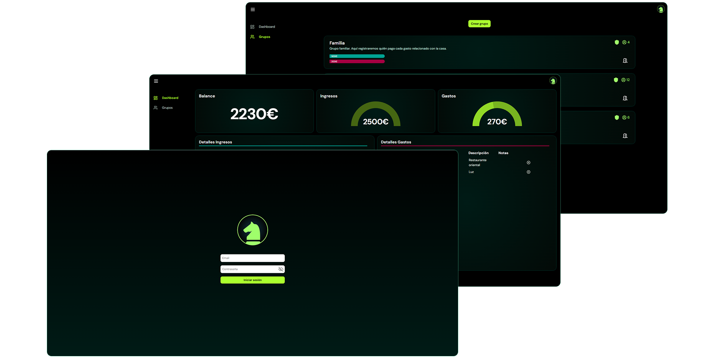
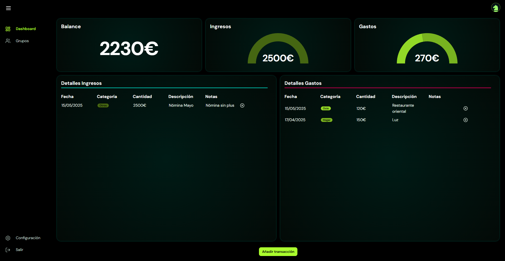
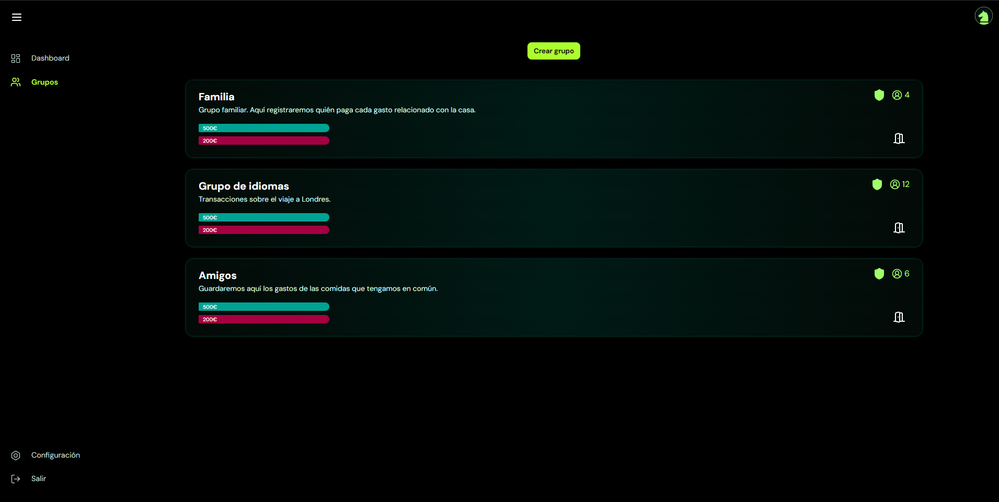

# Proyecto Finance Manager

</br>




<span style="display:flex; justify-content:center; margin-block: 24px">


</span>

🌐 Acceso → [Finance Manager](https://finance-manager-hazel.vercel.app/) 

## 📋  Contenido
1. [Introducción](#🚀-introducción)
2. [Tech Stack](#💻-tech-stack)
3. [Features](#⭐-features)
4. [Conceptos aplicados](#🧠-conceptos-aplicados)
5. [Estado actual del desarrollo](#🚧-estado-actual-del-desarrollo)
6. [Demo: Instrucciones](#👣-demo-instrucciones)
7. [Instalación](#🔌-instalación)

</br>

## 🚀  Introducción

Este proyecto tiene como objetivo facilitar a los usuarios la gestión de su presupuesto personal y compartido con otros usuarios. Para ello, el sistema permite al usuario registrar todas sus transacciones y crear grupos para gestionar transacciones de manera colectiva.

Actualmente se encuentra en construcción, siguiendo buenas prácticas y estándares de desarrollo, con el fin de exponer los conceptos que domino en las distintas áreas de la ingeniería y la programación.

</br>

## 💻 Tech Stack
**Frontend**
- React (v18.3.1)

- CSS puro
- TypeScript

**Backend & Base de datos**
- Node.js (v18.18.0)
- Express.js (v5.1.0)
- Supabase (PostgreSQL)
- TypeScript

**Modelado de la base de datos**
- draw.io

**Diseño y mockups**
- Figma
- Mockups manuales

**Despliegue**
- Vercel

**Testing**
- Vitest

</br>

## ⭐ Features
- ✅ Login y sesión respaldada con JWT.
- ✅ Registro de transacciones.
- ✅ Dashboard para visualizar el presupuesto personal (Balance, ingresos, gastos y detalles).
- ✅ Light Mode.
- ✅ Creación de grupos.
- 🟨 Gestión de grupos.

</br>

## 🧠 Conceptos aplicados

### **General**
- Arquitectura limpia
- Principios SOLID
- Buenas prácticas
- Monorepo


### **Frontend**

 Cada componente y elemento se ha construido con el fin de ser reutilizable y realizar únicamente su cometido, manteniendo un orden claro y separación de responsabilidades.

 Se ha procurado implementar el frontend utilizando el menor número de librerías externas posible, con el fin de demostrar la capacidad de construir componentes y funcionalidades interesantes desde cero.

 A continuación se especifican las librerías, tecnologías y estructuras aplicadas:

- **Custom Hooks** - Para gestiones generales como cálculo de balance, logout, gestión del sidebar, etc.
- **React Redux Toolkit** - Para gestionar estados globales en la aplicación.
- **React Router v7** - Para gestionar las rutas. Además, se ha implementado *Suspense* y *Lazy Loading* para optimizar el rendimiento y la carga de la aplicación.
- **React Tanstack Query** - Para gestionar el estado de las peticiones a la API.
- **Axios** - Para la comunicación con la API. (Interceptores según autorización y tipo de requests).
- **React Hook Form** - Para gestionar formularios (Validaciones, envío, etc).
- **React Tanstack Table** - Para el desarrollo y visualización de tablas.
- **Vitest** - Para realizar algunos tests unitarios.
- **Responsive Design** - Diseño adaptado a la mayoría de dispositivos (Mediante *Media Queries*, *Grid* y *Flexbox*)
- **Framer Motion** - Para animaciones

### **Backend**

Se ha desarrollado una restAPI con el framework *ExpressJS*, siguiendo unas buenas prácticas de desarrollo.

A continuación se detallan las librerías, tecnologías, estructuras y patrones de diseño aplicados:

- **Clean architecture** - Se ha procurado seguir una arquitectura limpia a la hora de organizar y distribuir los archivos de la API para separar responsabilidades y facilitar su escalabilidad, desacoplando cada capa (Dominio, infraestructura, aplicación, interfaces, etc).
- **Repository Pattern** - Se ha implementado el patrón repositorio para desacoplar la capa de persistencia, permitiendo cambiar de fuente de datos sin afectar al dominio y facilitando la implementación de pruebas unitarias.
- **Despliegue continuo** - Se realiza un despliegue continuo mediante *Vercel*.
- **Swagger** - Se ha implementado para documentar la API y facilitar el testing de algunos endpoints.


</br>

## 🚧 Estado actual del desarrollo

 ### **15/05/25**: 
 - Actualmente las transacciones se guardan en el LocalStorage (se está migrando la funcionalidad para interactuar con la base de datos)
 - La creación de grupos está parcialmente desarrollada (Se permiten añadir grupos y visualizar aquellos creados por uno mismo, a falta de implementar acciones complementarias)

</br>

## 👣 Demo: Instrucciones

### Acceso a la aplicación
A continuación se detallan los pasos para probar la aplicación mediante un usuario de test.
1.  Entrar a la siguiente URL:
[Finance Manager](https://finance-manager-hazel.vercel.app/) 
2. Acceder con usuario y contraseña:
    - Usuario: *`demo@test.com`* 
    - Contraseña: *`Demo1!`*

Una vez dentro, el usuario se encontrará con las siguientes funcionalidades en el sidebar:
- **Dashboard:** Aquí podrá ver su balance personal, ingresos, gastos y sus detalles, así como registrar nuevas transacciones.

    

- **Grupos:** Aquí podrá ver los grupos que ha creado y a los que pertenece, además de poder crear nuevos.

    

</br>

## 🔌 Instalación

El proyecto esta alojado en un único repositorio, ubicando todo el desarrollo del frontend en la carpeta ***finance-manager*** y el backend en la carpeta ***finance-manager-server***.

> ⚠️ *Se recomienda instalar las dependencias y ejecutar utilizando el gestor de paquetes ***pnpm***, ya que es el que se ha empleado en el desarrollo del proyecto.*

Existen dos maneras de instalar el proyecto:

**A. Instalación semi local (Frontend — Local | Backend — Producción):** Se podrá ejecutar el frontend apuntando al backend y base de datos que están en producción.  

**B. Totalmente local:** Se podrá ejecutar el frontend y el backend localmente. Pero esta opción requiere de tener acceso a la base de datos. 
>ℹ️ *En caso de preferir esta opción, contáctame por correo electrónico para obtener las variables de entorno o el esquema de la base de datos para replicarla en tu entorno local.*

### **A. Instalación semi local (Frontend — Local | Backend — Producción)**


1. Clonar el repositorio:
    ```bash
    git clone https://github.com/svb1998/finance-manager.git
    cd finance-manager
    ```
2. Instalar las dependencias del frontend:

    ```bash
    cd finance-manager
    pnpm install
    ```

3. En la carpeta ***finance-manager***, duplicar el archivo *.env.template*, renombrarlo como *.env* y rellenar la variable de entorno apuntando a la URL de la API de producción `VITE_API_URL=https://finance-manager-dxl9.vercel.app`


4. Ejecutar el frontend:
    ```bash
    cd ../finance-manager
    pnpm run dev
    ```

5. Acceder a la aplicación en el navegador: http://localhost:5173


### **B. Totalmente local**

1. Clonar el repositorio:
    ```bash
    git clone https://github.com/svb1998/finance-manager.git
    cd finance-manager
    ```
2. Instalar las dependencias del frontend:

    ```bash
    cd finance-manager
    pnpm install
    ```

3. En la carpeta ***finance-manager***, duplicar el archivo *.env.template*, renombrarlo como *.env* y rellenar la variable de entorno apuntando al backend localmente `VITE_API_URL=http://localhost:4000`
    

4. En la carpeta ***finance-manager-server***, duplicar el archivo *.env.template*, renombrarlo como *.env* y rellenar las variables de entorno.

    ☝️ *Para obtener las variables de entorno relacionadas a la base de datos, contáctame por privado.*

5. Ejecutar el backend:
    ```bash
    cd ../finance-manager-server
    pnpm run dev
    ```
6. Ejecutar el frontend:
    ```bash
    cd ../finance-manager
    pnpm run dev
    ```
7. Acceder a la aplicación en el navegador: http://localhost:5173

</br>

---


Para cualquier duda o sugerencia, puedes contactarme a este correo: steven.valencia1998@gmail.com


